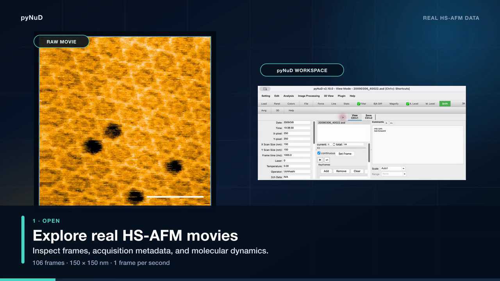
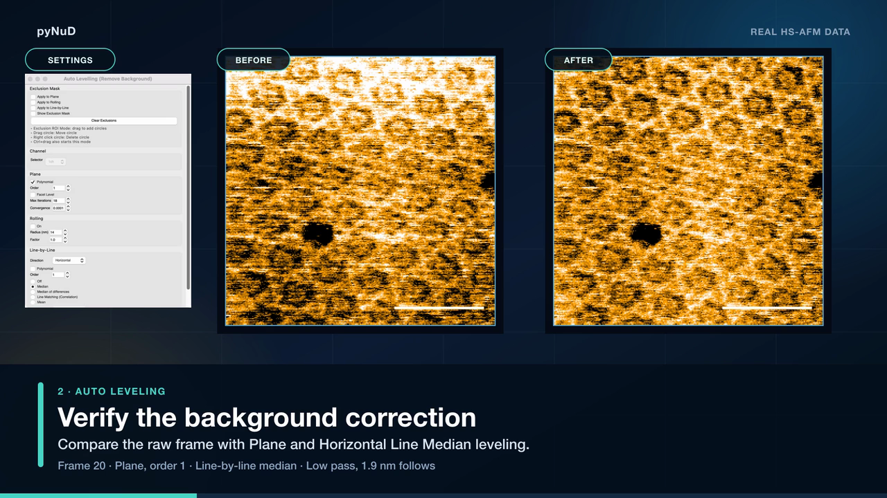
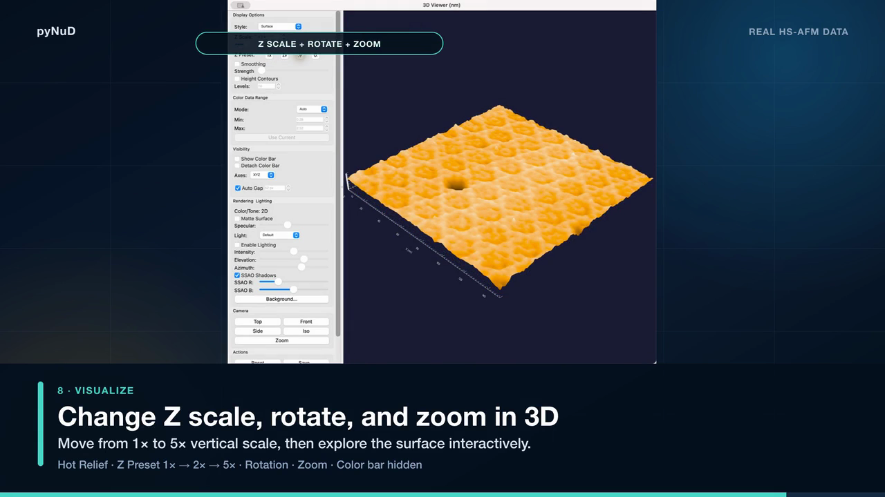

# pyNuD

**HS-AFM Image Viewer** — open, process, analyze, visualize and export
high-speed atomic force microscopy data in a single application.

**[⬇ Download the latest release](https://github.com/uchihast/pyNuD-installer/releases/latest)**

---

## Download

| Platform | Installer | Auto-update |
| --- | --- | --- |
| macOS | PKG installer | ✅ |
| Windows | Setup EXE (win64) | ✅ |

Both installers are attached to the **[latest release](https://github.com/uchihast/pyNuD-installer/releases/latest)**.

> [!NOTE]
> The macOS pkg is unsigned and may be blocked the first time you open it.
> If that happens, open **System Settings → Privacy & Security**, find the message
> about this installer near the bottom, and choose **"Open Anyway"** before running it.

## What it does

pyNuD takes you from a raw acquisition to a quantitative, shareable result without
leaving the application or writing a line of script. 1ch and 2ch data are loaded,
displayed and analyzed in one integrated workflow.

### Processing

- Rolling and polynomial leveling
- Spatial, FFT and wavelet filters
- Destriping and drift correction
- All-frame and pattern averaging

### Quantitative analysis

- Histograms and statistics
- Force curves and force maps
- Molecule and particle tracking

### Visualization and output

- Line profiles and interactive 3D surfaces
- Publication-ready images and movies
- Expandable analysis plugins

 

## Supported formats

pyNuD is centered on the high-speed AFM data format (`.asd`) developed by the
**Ando Laboratory at Kanazawa University**, and also reads most major AFM image
and surface-data formats:

`.asd` · Bruker/NanoScope `.spm` · Gwyddion `.asc` `.gsf` · BCR/BCRF ·
HDF5 / ARDF / ARIS · Asylum / Igor Binary Wave `.ibw` · JPK-style containers

## Plugins

Analysis plugins are distributed separately as single `.py` files and loaded from
**Plugin → Load Plugin…** — particle tracking, kymographs, L-AFM super-resolution,
filament contour analysis, dwell-time analysis, movie editing and more.

→ **[uchihast/pyNuD-plugins](https://github.com/uchihast/pyNuD-plugins)**

## pyNuD Simulator

A standalone companion application that simulates AFM images from PDB/mmCIF
structures, aligns models to experimental images, and performs flexible fitting
(open-source PyMOL bundled). It is *not* included in pyNuD itself.

→ **[uchihast/pyNuDSim-Installers](https://github.com/uchihast/pyNuDSim-Installers)**

To push the AFM frame currently shown in pyNuD to the Simulator (Live sync), load the
[`SimulatorBridge.py`](https://github.com/uchihast/pyNuD-plugins/releases/latest/download/SimulatorBridge.py)
plugin in pyNuD.

## Documentation

The full documentation lives on the D-Lab software page and is available in both
**English and Japanese** — use the language switch at the top of the page.

| | |
| --- | --- |
| 📖 **User manual** | [dlab-website-2026.vercel.app/software?section=operation](https://dlab-website-2026.vercel.app/software?section=operation) |
| 🛠 Installation guide | [?section=install](https://dlab-website-2026.vercel.app/software?section=install) |
| 🧩 Plugin reference | [?section=plugins](https://dlab-website-2026.vercel.app/software?section=plugins) |
| 📝 Version history | [?section=history](https://dlab-website-2026.vercel.app/software?section=history) |
| ⬇ Downloads and overview | [/software](https://dlab-website-2026.vercel.app/software) |

> [!NOTE]
> The release notes attached to each GitHub release are written in Japanese.
> The **Version history** page above carries the same notes in English.

## Support

Questions and bug reports: `uchihast [at] d.phys.nagoya-u.ac.jp`
(or the bug report form at [?section=support](https://dlab-website-2026.vercel.app/software?section=support))

## Citing pyNuD

If pyNuD contributed to your analysis, please mention it in your Methods, for example:

> HS-AFM images were processed and analyzed with pyNuD vX.Y.Z
> (https://github.com/uchihast/pyNuD-installer).

Replace `vX.Y.Z` with the version you actually used — it is shown in the pyNuD
title bar and under **Help → About**.

## License

[MIT](LICENSE) — developed in the
[Uchihashi Laboratory (D-Lab)](https://dlab-website-2026.vercel.app/),
Department of Physics, Nagoya University.
